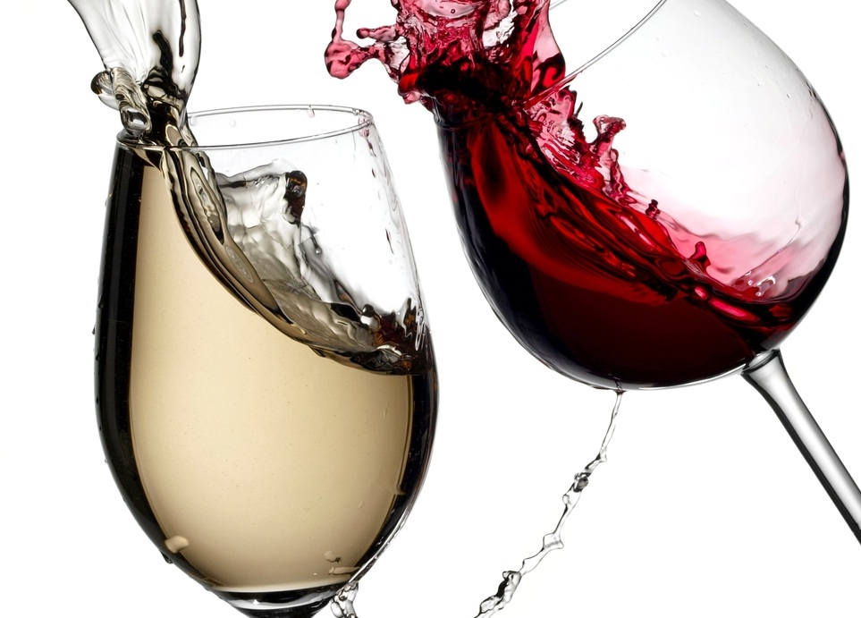

myWineApp
========================================================
author: Rodrigo Martins
date: November 24, 2014
transition: rotate

***



PROJECT SUMMARY
========================================================
transition: rotate

The **myWineApp** is based on the following reference work :

P. Cortez, A. Cerdeira, F. Almeida, T. Matos and J. Reis. 
Modeling wine preferences by data mining from physicochemical properties.
In Decision Support Systems, Elsevier, 47(4):547-553. ISSN: 0167-9236.

In the mentioned work, 1,599 samples of red and 4,898 samples of white variants of the Portuguese 'Vinho Verde' wine were tested for a total of 11 different chemical characteristics.

Based on the available datasets from this project, a prediction model using Random Forests method with `bigrf` packacage was built in `R`, using the most relevant chemical variables which differentiate a **white wine** from a **red wine**.

PREDICITON FUNCTION - myWine
========================================================
transition: rotate

The created function, **myWine**, is pretty lengthy, and would not be appropriately viewed in a slide.

For this reason, the code was made available in the file **myWine.R**, at GitHub.

Please visit : 

https://github.com/rodrigodmartins/Developing-Data-Products  (repository)

https://github.com/rodrigodmartins/Developing-Data-Products/blob/master/myWine.R    (Code script)


myWine FUNCTION IN ACTION
========================================================
transition: rotate


```r
myWine(dens=0.995,totso2=120,rs=3,alc=10)
```

```
OOB errors:
 Tree  Overall error  Error by class
                        Red  White
   10           1.86   3.75   1.25
   20          0.831  2.251  0.367
Processing tree number:
   10
   20
```

```
[1] "White"
```

The set of chemical characteristics **Density = 0.995g/mL, Total sulfur dioxide = 120mg/L, Residual sugar = 3g/L and Alcohol = 10%**, is a typical set for a **white wine**.

INSTRUCTIONS FOR USING myWineApp
========================================================
transition: rotate
- Access the website : https://rodrigodmartins.shinyapps.io/Developing-Data-Products/
- On the left side of the page, adjust the desired values for **density, total sulfur dioxide, residual sugar and alcoholic content** in the sliding bars and press **Submit button**. Please wait for few seconds for the computation.
- It is recommended to change one variable at a time, in order you can understand better the influence of each variable in the prediction of the type of wine.
- In case of doubts, please refer to this presentation or access the tab "Summary and instructions".
